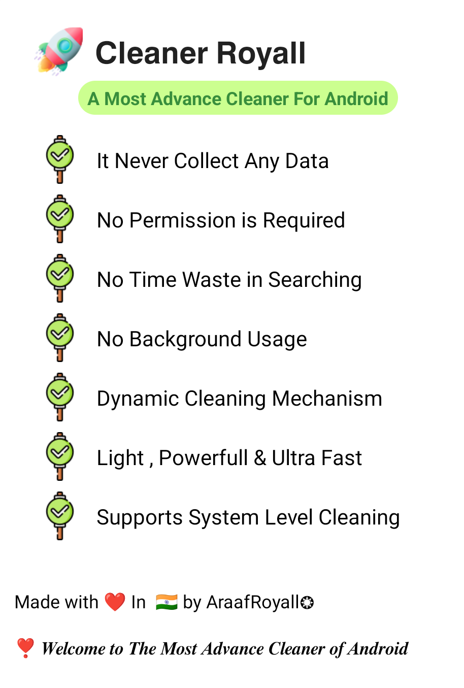

  

# Cleaner Royall 

𝗧𝗵𝗲 𝗕𝗲𝘀𝘁 𝗖𝗹𝗲𝗮𝗻𝗶𝗻𝗴 𝗔𝗽𝗽 𝗘𝘃𝗲𝗿 𝗠𝗮𝗱𝗲

*  Light weight but Ultra Fast & Powerful
*  No Permission Required (Except Root)
*  Never Collect Any Data.
*  Super Fast Cleaner

## Requirements 
   • Root or Magisk & Busybox only

•••••••••••••••••••••••••••••••••

  

### Developer Contact details

Telegram id : @araafroyall

Email : araafroyall@digdig.org

Gmail : araafroyall@gmail.com

•••••••••••••••••••••••••••••••••••

## Screenshots

